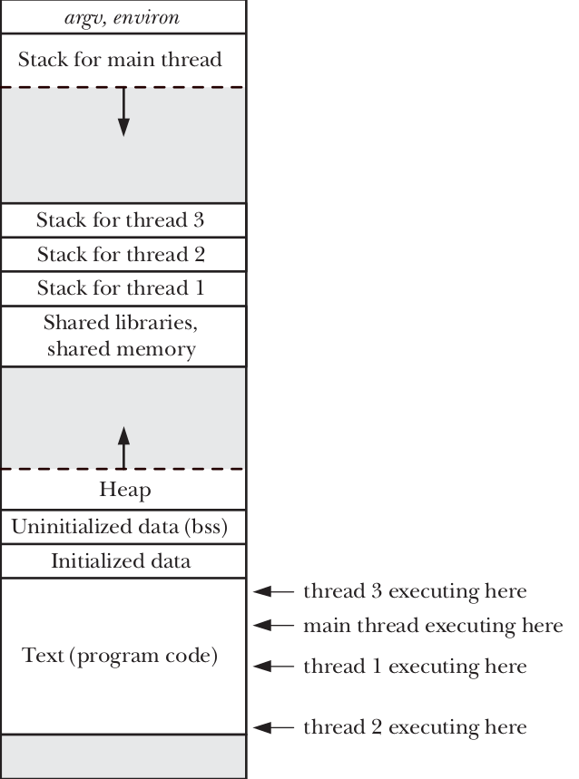

## What is a Thread?

A **thread** is the smallest unit of execution within a process. It is a sequence of instructions that can be executed independently by a CPU. Threads share the same memory space and resources of the process they belong to, which makes them lightweight compared to processes. Multiple threads within a process can run concurrently, enabling parallel execution and efficient resource utilization.

In Linux, threads are implemented using the **POSIX threads (pthreads)** API, which is part of the POSIX standard for threading.

---

## Memory Representation of a Thread Inside a Process

When a process is created, it has a single thread of execution, often called the **main thread**. When additional threads are created, they share the same memory space as the main thread but have their own independent execution context. Here's how threads are represented in memory:

1. **Process Memory Layout**:
   - **Text Segment**: Contains the executable code (shared by all threads).
   - **Data Segment**: Contains global and static variables (shared by all threads).
   - **Heap**: Dynamically allocated memory (shared by all threads).
   - **Stack**: Each thread has its own private stack for local variables, function calls, and control flow.

2. **Thread-Specific Memory**:
   - Each thread has its own **stack**, which is used for storing local variables, function call frames, and return addresses.
   - Threads also have their own **thread-local storage (TLS)**, which allows them to store data that is unique to each thread.

3. **Shared Memory**:
   - Threads share the **text segment**, **data segment**, and **heap** of the process. This allows threads to access and modify global variables, shared resources, and dynamically allocated memory.

Here’s a simplified diagram of a process with multiple threads:



---

## Difference Between Threads and Processes (Using `fork` as an Example)

Let’s explore the differences in the context of a **network server design**, where the traditional UNIX approach uses `fork()` to create multiple processes, and the threaded approach uses `pthread_create()` to create multiple threads.

---

## Traditional UNIX Approach: Multiple Processes with `fork()`

In the traditional UNIX model, a network server might use a **parent process** to accept incoming client connections and then create a **child process** for each client using `fork()`. Here’s how it works:

1. **Parent Process**:
   - Listens for incoming client connections.
   - When a connection is accepted, it calls `fork()` to create a child process.

2. **Child Process**:
   - Handles communication with the client.
   - Runs independently of the parent process and other child processes.

### Limitations of the `fork()` Approach:
1. **Difficulty in Sharing Information**:
   - Processes created with `fork()` do not share memory (except for the read-only text segment).
   - To exchange data between processes, **interprocess communication (IPC)** mechanisms like pipes, shared memory, or message queues must be used. This adds complexity and overhead.

2. **High Process Creation Overhead**:
   - `fork()` is relatively expensive, even with **copy-on-write (COW)** optimization. COW delays the duplication of memory pages until one of the processes modifies them, but it still requires duplicating process attributes like page tables, file descriptor tables, and other kernel structures.
   - This makes process creation time-consuming, especially in scenarios where many clients need to be served simultaneously.

---

## Threaded Approach: Multiple Threads with `pthread_create()`

Threads address the limitations of the `fork()` approach by providing a lightweight alternative for achieving concurrency. In a threaded network server:

1. **Main Thread**:
   - Listens for incoming client connections.
   - When a connection is accepted, it creates a new thread using `pthread_create()`.

2. **Worker Thread**:
   - Handles communication with the client.
   - Shares the same memory space as the main thread and other worker threads.

### Advantages of the Threaded Approach:
1. **Easy and Fast Information Sharing**:
   - Threads share the same memory space, including global variables and the heap. This makes it easy to share data between threads by simply copying data into shared variables.
   - However, proper **synchronization mechanisms** (e.g., mutexes, semaphores) must be used to avoid race conditions when multiple threads access shared data concurrently.

2. **Low Thread Creation Overhead**:
   - Thread creation is significantly faster than process creation—typically **ten times faster or better**.
   - This is because threads share many attributes of the parent process, such as the address space, file descriptors, and signal dispositions. There is no need to duplicate page tables or memory pages, as is required with `fork()`.

---

## Shared Attributes Between Threads

Threads within the same process share the following attributes:

1. **Process Attributes**:
   - Process ID and parent process ID.
   - Process group ID and session ID.
   - Controlling terminal.
   - Process credentials (user and group IDs).
   - Open file descriptors.
   - Record locks created using `fcntl()`.
   - Signal dispositions.
   - File system–related information: `umask`, current working directory, and root directory.
   - Interval timers (`setitimer()`) and POSIX timers (`timer_create()`).
   - System V semaphore undo (`semadj`) values.
   - Resource limits.
   - CPU time consumed (as returned by `times()`).
   - Resources consumed (as returned by `getrusage()`).
   - Nice value (set by `setpriority()` and `nice()`).

2. **Memory**:
   - Text segment (executable code).
   - Data segment (global and static variables).
   - Heap (dynamically allocated memory).

---

## Thread-Specific Attributes

Each thread has its own private attributes, which are not shared with other threads:

1. **Thread ID**:
   - A unique identifier for the thread.

2. **Signal Mask**:
   - Defines which signals are blocked for the thread.

3. **Thread-Specific Data**:
   - Data that is unique to each thread (e.g., using `pthread_key_create()` and `pthread_setspecific()`).

4. **Alternate Signal Stack**:
   - Used for handling signals on a separate stack (`sigaltstack()`).

5. **`errno` Variable**:
   - Each thread has its own `errno` variable to store error codes.

6. **Floating-Point Environment**:
   - The state of floating-point operations (see `fenv(3)`).

7. **Realtime Scheduling Policy and Priority**:
   - Defines the scheduling behavior of the thread (Sections 35.2 and 35.3).

8. **CPU Affinity**:
   - Specifies which CPUs the thread can run on (Linux-specific).

9. **Capabilities**:
   - Linux-specific capabilities (see Chapter 39).

10. **Stack**:
    - Local variables and function call linkage information.

---

## Threads and `errno`

In traditional UNIX systems, `errno` is a global integer variable used to report errors from system calls and library functions. However, this approach doesn't work well in multithreaded programs because multiple threads could simultaneously modify and read the global `errno`, leading to **race conditions** and incorrect error reporting.

### Problem with Global `errno` in Threads:
- If multiple threads make system calls or library functions that set `errno`, they could overwrite each other's error values.
- For example:
  - Thread A makes a system call that fails and sets `errno`.
  - Before Thread A checks `errno`, Thread B makes another system call that overwrites `errno`.
  - Thread A now reads the wrong error value, leading to incorrect behavior.

### Solution: Thread-Specific `errno`
To address this issue, in threaded programs, each thread has its own **thread-specific `errno`**. This ensures that:
- Each thread's `errno` is independent of other threads.
- There is no risk of race conditions when multiple threads make system calls or library functions.

### Implementation:
- On Linux and most UNIX systems, `errno` is defined as a **macro** that expands into a function call returning a **modifiable lvalue** (a value that can be assigned to). This lvalue is unique for each thread.
- For example:
  ```c
  #define errno (*__errno_location())
  ```
  Here, `__errno_location()` is a function that returns a pointer to the thread-specific `errno` variable.

### Key Points:
1. **Thread-Specific Storage**:
   - Each thread has its own `errno` variable stored in its **thread-local storage (TLS)**.
   - This ensures that modifications to `errno` by one thread do not affect other threads.

2. **Backward Compatibility**:
   - The `errno` mechanism has been adapted for threads in a way that maintains compatibility with the traditional UNIX API.
   - Programs can still use `errno` as before (e.g., `if (errno == EINTR) { ... }`), without needing to change their code.

---

## Creation of Threads (pthreads)

### How to Create a Thread

To create a thread in Linux, you use the `pthread_create()` function from the `pthread` library. This function allows you to:
- Define a function that the thread will execute.
- Pass arguments to the thread function.
- Specify thread attributes (optional).

Once created, the thread runs concurrently with the main thread and other threads in the program.

```c
int pthread_create(pthread_t *thread, const pthread_attr_t *attr, void *(*start_routine)(void *), void *arg);
```

#### Parameters:
1. **`pthread_t *thread`**:
   - A pointer to a `pthread_t` variable where the thread ID will be stored.
   - This is an **output parameter**.
   - Example: `pthread_t thread_id;`

2. **`const pthread_attr_t *attr`**:
   - A pointer to a `pthread_attr_t` structure that specifies thread attributes (e.g., stack size, scheduling policy).
   - If `NULL`, default attributes are used.
   - Example: `NULL` (for default attributes).

3. **`void *(*start_routine)(void *)`**:
   - A pointer to the function that the thread will execute.
   - The function must take a `void*` argument and return a `void*`.
   - Example: `void* thread_func(void *arg) { ... }`

4. **`void *arg`**:
   - The argument passed to the `start_routine` function.
   - This allows passing data to the thread.
   - Example: `(void *)"1"` (passing a string as an argument).

#### Return Value:
- Returns `0` on success.
- Returns an error code on failure (e.g., `EAGAIN` if system resources are exhausted).

---

### Example Code

```c
#include <pthread.h>
#include <unistd.h>
#include <stdio.h>

// Thread function
void *thread_func1(void *name) {
    printf("Hello from thread[%s]!!\n", (unsigned char *)name);
    return NULL;  // Thread exits
}

// Thread identifier
pthread_t thread_func1_pt;

int main() {
    // Create a thread
    int status = pthread_create(&thread_func1_pt, NULL, thread_func1, (void *)"1");
    if (status != 0) {
        printf("Error in creating the thread!!\n");
        return 1;
    }

    // Main thread continues execution
    printf("Hello from main thread!!\n");

    // Allow time for the thread to finish
    sleep(1);

    return 0;
}
```
---

### Code Explanation

Let’s break down the code step by step:

#### Step 1: Define the Thread Function
```c
void *thread_func1(void *name) {
    printf("Hello from thread[%s]!!\n", (unsigned char *)name);
    return NULL;  // Thread exits
}
```
- This is the function that the new thread will execute.
- It takes a `void*` argument, which allows passing any type of data to the thread.
- In this case, the argument is cast to a string (`unsigned char*`) and printed.
- The function returns `NULL` to indicate successful completion.

#### Step 2: Declare a Thread Identifier
```c
pthread_t thread_func1_pt;
```
- `pthread_t` is a data type used to store the thread identifier.
- `thread_func1_pt` will hold the ID of the newly created thread.

#### Step 3: Create the Thread in `main()`
```c
int status = pthread_create(&thread_func1_pt, NULL, thread_func1, (void *)"1");
if (status != 0) {
    printf("Error in creating the thread!!\n");
    return 1;
}
```
- `pthread_create()` is called to create a new thread.
- The first argument (`&thread_func1_pt`) stores the thread ID.
- The second argument (`NULL`) specifies default thread attributes.
- The third argument (`thread_func1`) is the function the thread will execute.
- The fourth argument (`(void *)"1"`) is passed to the thread function as its argument.
- If `pthread_create()` fails, it returns a non-zero value, and an error message is printed.

#### Step 4: Main Thread Continues Execution
```c
printf("Hello from main thread!!\n");
```
- The main thread continues executing independently of the new thread.
- This demonstrates the concurrent nature of threads.

#### Step 5: Allow Time for the Thread to Finish
```c
sleep(1);
```
- `sleep(1)` pauses the main thread for 1 second, allowing the child thread to complete its execution.
- Without this, the main thread might terminate before the child thread finishes, causing the program to exit prematurely.

---

#### Output of the Example

When you run the program, the output will look like this:

```
Hello from main thread!!
Hello from thread[1]!!
```

---

## `pthread_exit` Library call

### Syntax:
```c
void pthread_exit(void *retval);
```

### Purpose:
- Terminates the calling thread and returns a value (`retval`) that can be retrieved by another thread using `pthread_join`.

### Key Points:
- **Thread Termination**: When a thread calls `pthread_exit`, it terminates itself without affecting other threads in the program.
- **Return Value**: The `retval` parameter is a pointer to a value that the thread wants to return. This value can be retrieved by another thread using `pthread_join`.
- **Difference from `return` or `exit`**:
  - If a thread calls `return` or `exit`, the entire program terminates, including all threads.
  - If a thread calls `pthread_exit`, only that thread terminates, and the program continues running.
---

## `pthread_self` Library call

### Syntax:
```c
pthread_t pthread_self(void);
```

### Purpose:
- Returns the thread ID of the calling thread.

### Key Points:
- **Thread Identification**: Each thread has a unique identifier of type `pthread_t`.
- **Use Case**: This function is useful when a thread needs to know its own ID, for example, for logging or debugging purposes.


---

## `pthread_join` Library call

### Syntax:
```c
int pthread_join(pthread_t thread, void **retval);
```

### Purpose:
- Waits for a specific thread to terminate and retrieves its return value.

### Key Points:
- **Thread Synchronization**: `pthread_join` blocks the calling thread until the specified thread (`thread`) terminates.
- **Return Value**: If `retval` is not `NULL`, the return value of the terminated thread is stored in `*retval`.
- **Use Case**: This function is used to ensure that a thread has completed its execution before proceeding further.

---

## `pthread_equal` Library call

### Syntax:
```c
int pthread_equal(pthread_t t1, pthread_t t2);
```

### Purpose:
- Compares two thread IDs to check if they are equal.

### Key Points:
- **Thread ID Comparison**: `pthread_t` is an opaque data type, meaning its internal structure is not exposed. You cannot directly compare two `pthread_t` values using `==`.
- **Use Case**: This function is used to compare thread IDs safely and portably.

### Why Use `pthread_equal` Instead of `==`?

- **Opaque Data Type**: The `pthread_t` type is implementation-defined and may not be a simple integer or pointer. Using `==` to compare `pthread_t` values is not portable and may lead to incorrect results.
- **Portability**: `pthread_equal` is a standardized function that works across all POSIX-compliant systems, ensuring consistent behavior.
- **Safety**: Using `pthread_equal` avoids undefined behavior that could occur if `pthread_t` is not a primitive type.

---
## `pthread_detach` Library call  

### Syntax:  
```c
int pthread_detach(pthread_t thread);
```  

### Purpose:  
- **Detaches a thread**, allowing it to release its resources automatically upon termination.  

### Key Points:  
- **Detached State**: A detached thread **cannot be joined** using `pthread_join`. It cleans up after itself when it finishes execution.  
- **Resource Management**: When a detached thread terminates, its resources (stack, thread descriptor) are immediately reclaimed by the system, preventing memory leaks.  
- **Use Case**: Useful when a thread's termination **does not need to be synchronized** with the main program. For example, in background worker threads that should run independently.  

---
## Attributes passed to the Threads:

- We can give the thread when creating it the attributes to configure it(like stack size - scheduling policy ) or leaving it as NULL so the thread will be configured with the default attributes which changes from an architecture to another. 
- We can specify the attributes given to the thread when calling `pthread_create()`.

### Steps to specify The attributes
- We Specify the attributes by using the following sequence:
   1. Create an attribute structure.
   2. Initialize that structure using `pthread_attr_init()` Library Call.
   3. Configure the attributes using the Library Call related to that attribute.
   4. create the thread with the configured structure.
   5. destroy the attribute structure using `pthread_attr_destroy()` Library Call which won't affect the created thread.


### Attributes Available
There are a lot of useful attributes which we can configure you can find them by typing `man 3 pthread_attr` and add double tab, it will show all the Library Calls which are related to the attributes of `pthread`. i will talk about 3 of them which are:

#### 1. Stack Configuration
We can configure the `stack start address` & `stack size`using the following library calls.
   1. `pthread_attr_setstack()`: Set the stack start address and size.
   2. `pthread_attr_setstackaddr()`: Set the stack start address only.
   3. `pthread_attr_setstacksize()` : Set the stack size.
   4. `pthread_attr_getstack()`: get the stack start address and size.
   5. `pthread_attr_getstackaddr()`: get the stack start address only.
   6. `pthread_attr_getstacksize()` : get the stack size.

#### 2. Scheduling Policy
Defines the scheduling algorithm(see `man 7 sched` and search for `SCHED_FIFO` in it).
We can configure it and get the configurations using the following Library Calls.
   1. `pthread_attr_getschedpolicy()`
   2. `pthread_attr_setschedpolicy()`

#### 3. scheduling parameter
specifies the priority of the thread inside the `sched_param` structure passed to the `pthread_attr_setschedparam()` Library Call, as it contains only one parameter which is `sched_priority`.
We can configure it and get the configurations using the following Library Calls.
   1. `pthread_attr_getschedparam()`
   2. `pthread_attr_setschedparam()`

### Example:
This Example is copied from the book as it is :).
```c
pthread_t thr;
pthread_attr_t attr;
int s;

s = pthread_attr_init(&attr);
if (s != 0)
   errExitEN(s, "pthread_attr_init"); /* Assigns default values */

s = pthread_attr_setdetachstate(&attr, PTHREAD_CREATE_DETACHED);
if (s != 0)
   errExitEN(s, "pthread_attr_setdetachstate");

s = pthread_create(&thr, &attr, threadFunc, (void *) 1);
if (s != 0)
   errExitEN(s, "pthread_create");

s = pthread_attr_destroy(&attr); /* No longer needed */
if (s != 0)
   errExitEN(s, "pthread_attr_destroy");
```


---
### Threads VS Processes:

---

| **Aspect**                     | **Threads**                                                                 | **Processes**                                                              |
|---------------------------------|-----------------------------------------------------------------------------|----------------------------------------------------------------------------|
| **Data Sharing**                | Sharing data between threads is easy (shared memory space).                 | Sharing data between processes requires mechanisms like shared memory or pipes. |
| **Creation Speed**              | Thread creation is faster than process creation.                            | Process creation is slower due to the overhead of duplicating resources.   |
| **Context Switching**           | Context-switch time is generally lower for threads.                         | Context-switch time is higher for processes.                               |
| **Thread Safety**               | Requires ensuring functions are thread-safe or called in a thread-safe manner. | No need to worry about thread safety.                                      |
| **Fault Isolation**             | A bug in one thread (e.g., memory corruption) can affect all threads in the process. | Processes are isolated; a bug in one process does not affect others.       |
| **Virtual Address Space**       | Threads share the same virtual address space, which can be a limitation for large numbers of threads or memory-intensive threads. | Each process has its own virtual address space, allowing full use of available memory. |
| **Signal Handling**             | Signal handling in multithreaded applications requires careful design.       | Signal handling is simpler in single-threaded processes.                   |
| **Program Execution**           | All threads must run the same program (though they can execute different functions). | Different processes can run different programs.                            |
| **Resource Sharing**            | Threads share file descriptors, signal dispositions, current working directory, and user/group IDs. | Processes do not share these resources unless explicitly set up (e.g., file descriptors). |
| **Scalability**                 | Limited by the shared virtual address space and potential contention for resources. | More scalable for memory-intensive tasks due to isolation and independent address spaces. |
| **Complexity**                  | Requires careful synchronization (e.g., mutexes, condition variables) to avoid race conditions. | Easier to manage in terms of isolation, but inter-process communication is more complex. |

---

### When to Use Threads vs. Processes

| **Use Threads When**                                                                 | **Use Processes When**                                                                 |
|--------------------------------------------------------------------------------------|---------------------------------------------------------------------------------------|
| You need efficient data sharing between tasks.                                       | You need strong isolation between tasks.                                              |
| The application is performance-critical and requires fast task creation/switching.   | The application is memory-intensive or requires independent virtual address spaces.   |
| Tasks are closely related and need to share resources (e.g., file descriptors).      | Tasks are independent and do not need to share resources.                             |
| You can ensure thread safety and handle synchronization properly.                    | You want to avoid the complexity of thread synchronization.                           |
| The application does not require running different programs.                         | The application requires running different programs.                                  |

---
